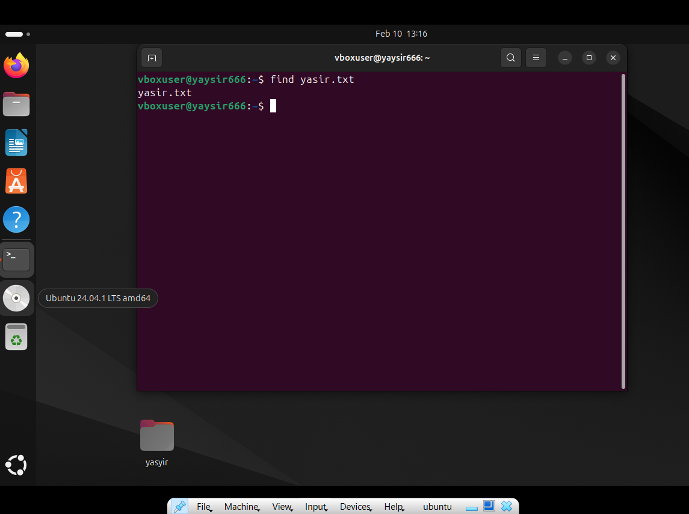

# yasyir_masyal__049__sistem_oprasi
tugas min 50 command linux

  <table>
        <tr>
            <th>Nama</th>
            <td>: yasyir masy'al</td>
        </tr>
        <tr>
            <th>Kelas</th>
            <td>: Tk 4 B</td>
        </tr>
        <tr>
            <th>Nim</th>
            <td>: 09030282327049</td>
        </tr>
    </table>

<h1 style="font-weight: bold;">
  50+ command dasar linux beserta fungsinya
</h1 >

<h3> Alat dan Bahan </h3>
<ol>
  
  <li>
     <h4>cat [file] – Menampilkan isi file.</h4>
  </li>

   
  <li>
     <h4>cd .. – Kembali ke direktori sebelumnya.</h4>
  </li>
  
   
  <li>
     <h4>cd [direktori] – Berpindah ke direktori lain.</h4>
  </li>

   
  <li>
     <h4>cmp file1.txt file2.txt – Membandingkan dua file byte per byte.</h4>
  </li>

 
  <li>
      <h4>cp [file] [tujuan] – Menyalin file ke lokasi lain.</h4>
  </li>
  
 
  <li>
     <h4>cd ~ – Kembali ke direktori home pengguna.</h4>
  </li>
  
 
  <li>
     <h4>curl -I google.com – Menampilkan header HTTP dari sebuah website.</h4>
  </li>
   
 
  <li>
     <h4>date – Menampilkan tanggal dan waktu saat ini.</h4>
  </li>
  
 
  <li>
     <h4>df -h – Menampilkan penggunaan ruang disk dalam format yang mudah dibaca.</h4>
  </li>
  
 
  <li>
     <h4>dig google.com – Menampilkan detail resolusi DNS untuk sebuah domain.</h4>
  </li>

   
  <li>
     <h4>du -sh [folder] – Menampilkan ukuran folder tertentu.</h4>
  </li>

   
  <li>
     <h4>echo "Hello" > file.txt – Menulis teks ke dalam file.</h4>
  </li>

   
  <li>
     <h4>find /path -name "*.txt" – Mencari file dengan ekstensi tertentu.</h4>
  </li>

  
  <li>
     <h4>watch -n 1 free -m – Memantau penggunaan RAM secara real-time.</h4>
  </li>
  
  
  <li>
     <h4>head -n 10 [file] – Menampilkan 10 baris pertama file.</h4>
  </li>
  
  
  <li>
     <h4>history – Menampilkan riwayat perintah yang telah dijalankan.</h4>
  </li>
  
  
  <li>
     <h4>host google.com – Melihat informasi DNS dari domain tertentu.</h4>
  </li>
  
  
  <li>
     <h4>hostname -I – Menampilkan alamat IP lokal.</h4> 
  </li>

   
  <li>
     <h4>hostname menampilan hostname</h4> 
  </li>
    
  <li>
     <h4>id – Menampilkan UID dan GID pengguna saat ini.</h4> 
  </li>
    
  <li>
     <h4>ifconfig – Menampilkan informasi jaringan. (Digunakan di sistem lama)</h4> 
  </li>
    
  <li>
     <h4>journalctl -xe – Menampilkan log sistem secara mendetail.</h4> 
  </li>
    
  <li>
     <h4>less [file] – Menampilkan isi file satu halaman per satu waktu.</h4> 
  </li>
    
  <li>
     <h4>ls -a – Menampilkan semua file, termasuk yang tersembunyi.</h4> 
  </li>
    
  <li>
     <h4>ls -l – Menampilkan daftar file dengan detail.</h4> 
  </li>
    
  <li>
     <h4>ls -l – Menampilkan daftar file dengan detail.</h4> 
  </li>
    
  <li>
     <h4>lsblk – Menampilkan daftar perangkat penyimpanan dan partisi.</h4> 
  </li>
    
  <li>
     <h4>mkdir [folder] – Membuat direktori baru.</h4> 
  </li>
    
  <li>
     <h4>mv [file] [tujuan] – Memindahkan atau merename file.</h4> 
  </li>
    
  <li>
     <h4>nano [file] – Membuka file dengan editor Nano.</h4> 
  </li>
    
  <li>
     <h4>netstat -tulnp – Menampilkan daftar port yang terbuka. </h4> 
  </li>
    
  <li>
     <h4>nmap -sP 192.168.1.0/24 – Melakukan pemindaian jaringan lokal.</h4> 
  </li>
    
  <li>
     <h4>ping google.com – Mengecek koneksi ke suatu host.</h4> 
  </li>
    
  <li>
     <h4>ps aux – Menampilkan daftar proses yang berjalan.</h4> 
  </li>
    
  <li>
     <h4>pwd – Menampilkan direktori kerja saat ini.</h4> 
  </li>
    
  <li>
     <h4>rm [file] – Menghapus file.</h4> 
  </li>
    
  <li>
     <h4>rm -r [folder] – Menghapus direktori beserta isinya.</h4> 
  </li>
    
  <li>
     <h4>stat file.txt – Menampilkan informasi detail tentang file.</h4> 
  </li>
    
  <li>
     <h4>tail -n 10 [file] – Menampilkan 10 baris terakhir file.</h4> 
  </li>
    
  <li>
     <h4>tar -cvf archive.tar folder/ – Membuat file TAR dari folder.</h4> 
  </li>
    
  <li>
     <h4>tar -xvf archive.tar – Mengekstrak file TAR.</h4> 
  </li>
    
  <li>
     <h4>time ls – Mengukur waktu eksekusi suatu perintah.</h4> 
  </li>
    
  <li>
     <h4>top – Menampilkan proses secara real-time.</h4> 
  </li>
    
  <li>
     <h4>touch [file] – Membuat file kosong baru.</h4> 
  </li>
    
  <li>
     <h4>traceroute google.com – Melihat jalur yang dilewati paket ke server tujuan.</h4> 
  </li>
    
  <li>
     <h4>tree – Menampilkan struktur direktori dalam bentuk pohon.</h4> 
  </li>
    
  <li>
     <h4>uname -a – Menampilkan informasi sistem.</h4> 
  </li>
    
  <li>
     <h4>unzip archive.zip – Mengekstrak file ZIP.</h4> 
  </li>
    
  <li>
     <h4>uptime – Menampilkan waktu aktif sistem sejak booting.</h4> 
  </li>
    
  <li>
     <h4>vim [file] – Membuka file dengan editor Vim.</h4> 
  </li>
    
  <li>
     <h4>w – Menampilkan daftar pengguna yang sedang aktif dan aktivitasnya.</h4> 
  </li>
    
  <li>
     <h4>watch -n 1 free -m – Memantau penggunaan RAM secara real-time.</h4> 
  </li>
    
  <li>
     <h4>who – Menampilkan siapa saja yang sedang login ke sistem.</h4> 
  </li>
    
  <li>
     <h4>whoami – Menampilkan nama pengguna saat ini.</h4> 
  </li>
    
  <li>
     <h4>zip -r archive.zip folder/ – Mengompres folder menjadi file ZIP.</h4> 
  </li>
  
</ol>

 
 

 
 

