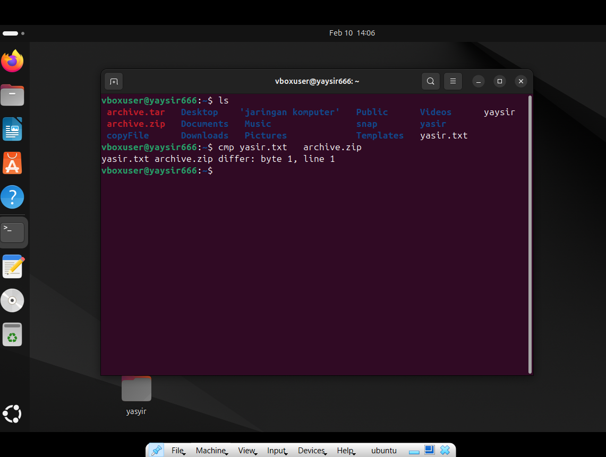

# yasyir_masyal__049__sistem_oprasi
tugas min 50 command linux

  <table>
        <tr>
            <th>Nama</th>
            <td>: yasyir masy'al</td>
        </tr>
        <tr>
            <th>Kelas</th>
            <td>: Tk 4 B</td>
        </tr>
        <tr>
            <th>Nim</th>
            <td>: 09030282327049</td>
        </tr>
    </table>

<h1 style="font-weight: bold;">
  50+ command dasar linux beserta fungsinya
</h1 >

<h3> Alat dan Bahan </h3>
<ol>
  
  <li>
     <h4>cat [file] – Menampilkan isi file.</h4>
  </li>

   
  <li>
     <h4>cd .. – Kembali ke direktori sebelumnya.</h4>
  </li>
  
   
  <li>
     <h4>cd [direktori] – Berpindah ke direktori lain.</h4>
  </li>

   
  <li>
     <h4>cmp file1.txt file2.txt – Membandingkan dua file byte per byte.</h4>
  </li>

 
  <li>
      <h4>cp [file] [tujuan] – Menyalin file ke lokasi lain.</h4>
  </li>
  
 
  <li>
     <h4>cd ~ – Kembali ke direktori home pengguna.</h4>
  </li>
  
 
  <li>
     <h4>curl -I google.com – Menampilkan header HTTP dari sebuah website.</h4>
  </li>
   
 
  <li>
     <h4>date – Menampilkan tanggal dan waktu saat ini.</h4>
  </li>
  
 
  <li>
     <h4>df -h – Menampilkan penggunaan ruang disk dalam format yang mudah dibaca.</h4>
  </li>
   
  
</ol>

 
 

 
 

